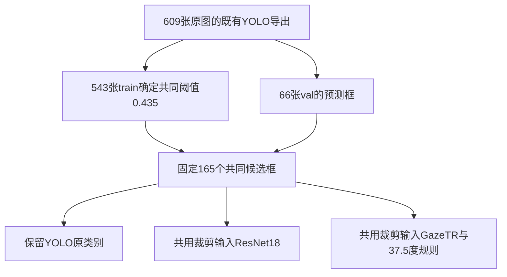

# VFOA 第三篇论文：共享 YOLO 人脸框的完整实验流程与结果

更新：2026-09-16。依据本轮返回的 `shared_yolo_results.zip`、已核验的 YOLO 导出、既有 GT 裁剪预测及上传的训练配置。本文区分已完成事实、结果解释和仍待核实项目。

## 1. 本轮结论

在相同的 YOLO 预测框、筛框阈值和定位匹配下，ResNet 分支的二分类 Macro-F1 为 **0.6568**，YOLO 直接判断为 **0.6128**，GazeTR 分支为 **0.4898**。

ResNet 相对 YOLO 的观察差值为 +0.0440，但按原图配对 bootstrap 的95%区间为 [-0.0318, 0.1316]，包含0。因此应写“本次验证中 ResNet 点估计较高”，不能写“已证明 ResNet 稳定或显著优于 YOLO”。本轮共享框、元数据、阈值和逐预测计分已重算一致。

三个分支共同检测到131个确定GT，漏掉27个。定位结果相同，分支成绩差异来自对共同候选的不同类别输出及其计分。YOLO使用原图特征，另两个模型使用裁剪图，因此并未控制全部输入和训练差异。

## 2. 我们到底在比较什么

论文研究的是自然场景图片中的 camera-directed VFOA，即“某张人脸是否在看摄像头”。目标是比较三种具体判断方案，而不是改进某个模型的网络或损失函数。

| 分支 | 人脸位置来自哪里 | VFOA 判断来自哪里 |
| --- | --- | --- |
| YOLO26直接判断 | 已训练YOLO26s的预测框 | 同次YOLO推理的三类输出 |
| 共享YOLO框 + ResNet18 | 与第一行完全相同的预测框 | 裁剪后用已训练ResNet18三分类 |
| 共享YOLO框 + GazeTR | 与第一行完全相同的预测框 | 冻结GazeTR预测pitch/yaw，再用37.5°规则 |

共享的是**同一批实际预测框**，不仅是检测器名称。候选ID、坐标、置信度、阈值和GT匹配都固定；这样可以控制定位结果，研究VFOA判断差异。

本轮没有使用RetinaFace或YuNet。也没有另训一个只识别人脸的YOLO。前端是已经用VFOA三类标注训练过的YOLO26s，其候选分布和置信度仍与原VFOA任务有关。结果应称为“共享VFOA训练YOLO候选框下的判断方案比较”，不能视为与三种方法完全独立的中性人脸检测前端。

## 3. 为什么既有609张图，又有66张图、165个框、131个人脸

### 3.1 数据划分

原始精修子集为613张：543 train、70 val。根据此前决定，排除4张重复验证图后，当前评价使用609张：543 train、66 val。

| 划分 | 原图数 | 不看(0) | 看(1) | uncertain(2) | 人脸总数 |
| --- | ---: | ---: | ---: | ---: | ---: |
| Train | 543 | 363 | 1037 | 280 | 1680 |
| Val，排除四张后 | 66 | 51 | 107 | 26 | 184 |
| 原始Val，供历史追溯 | 70 | 51 | 135 | 32 | 218 |

排除的是 `data_2022314_211.jpg`、`data_2022314_75.jpg`、`data_202339_3.jpg`、`data_202339_57.jpg`。之前发现两对相同原图，并存在部分looking/uncertain标签冲突；按用户决定整张排除，未逐脸挑选有利样本。已有权重保持不变，没有因为排除这四张图重新训练或重新选checkpoint。原模型仍曾接触原来的val选模过程。

### 3.2 不同数量的含义

- **609张**：YOLO导出覆盖全部train与val原图。这一步已经完成。
- **543张train**：本轮用已有预测与标注确定共同筛框阈值，不更新模型权重。
- **66张val**：模型比较的原图集合，不能混入训练图一起报告验证成绩。
- **184个GT人脸**：验证集人工标注的全部人脸。
- **158个确定GT**：51不看 + 107看，是二分类主指标的目标人脸。
- **165个预测框/裁剪**：共同阈值下YOLO保留的候选，包含误检与uncertain候选，数量不要求等于GT。
- **131个匹配的确定GT**：二类协议中，165个候选里有131个匹配到确定人脸；另外21个匹配到uncertain并忽略，13个未匹配。
- **27个漏检确定GT**：158−131，全部保留为评价错误。
- **6张无检测图片**：仍属于66张评价原图，不被删除。

因此“只生成66张图的人脸裁剪”不等于“只对66张图做过实验”。训练和阈值选择已经利用训练集；本轮不重训后端，只需要对验证图重新做后端推理。

## 4. 从最初的三个实验到这轮比较

### 4.1 人工框裁剪阶段

人脸位置来自WIDER FACE提供的标注框，你在这些人脸上增加了不看、看、uncertain标签。读取这些框裁剪，是使用已知人脸位置，不是运行了检测算法。

YOLO在原图上训练联合定位与三分类；ResNet在人工框裁剪上训练三分类；GazeTR在人工框裁剪上做冻结推理并校准角度阈值。人工框实验用于了解已知位置时的判断能力，不含前端漏检与多余框的代价。

### 4.2 已完成的YOLO导出

已有导出命令同时指定 `--splits train val`，因此609张图的预测已经存在。本轮直接读取返回的 `yolo_exports.zip`，无需重复运行相同YOLO。

导出分数下限为0.001。得到train8482条、val869条预测，其中train159条、val13条非正面积框。用于共用裁剪时对三分支一致排除不可裁剪框；所有这些无效框的分数都低于最终0.435，因此不影响最终候选集。原始记录仍在归档中，没有静默删除历史数据。

### 4.3 只在train上确定共同检测阈值

将train的三类GT都视为“人脸”，预测也只考虑位置、不使用预测类别决定是否为正确定位。按IoU≥0.5的一对一匹配，计算单类人脸F1：

`Face-F1 = 2TP / (2TP + FP + FN)`。

搜索0.001以及0.005至1.000、步长0.005，精确并列取较小阈值。选出 **0.435**：train定位TP1514、FP71、FN166，Face-F1=0.9274。

该阈值随后固定用于val，三分支完全共用。原YOLO导出置信度仍是VFOA三分类检测分数，并未变成新的人脸存在概率。

历史阈值0.425是按train二类VFOA Macro-F1选出的，属于另一个协议。这轮为控制前端而改用train定位目标，YOLO也必须按0.435重新计分，不能沿用旧分数。

### 4.4 生成共同裁剪并运行已有后端

在66张val原图上，保留0.435以上的165个有效框，YOLO预测类别分布为：39不看、97看、29uncertain。三个类别的框全部进入后端，不能只保留YOLO认为“看”的框，也不能借GT匹配筛掉误检。

保留浮点框用于匹配。裁剪使用原图RGB正向像素，margin=0，左上取floor、右下取ceil并裁到图像范围，保存PNG。ResNet和GazeTR读取相同裁剪字节，分别执行各自已有预处理。不做新增的人脸旋转对齐。



## 5. 三个模型的实际配置

| 项目 | YOLO26s | ResNet18 | GazeTR |
| --- | --- | --- | --- |
| 原实验输入 | 原图 | GT人脸裁剪 | GT人脸裁剪 |
| 训练/适配 | 三类检测训练，100 epochs，batch16，imgsz640 | ImageNet预训练后全网络微调；三类交叉熵、AdamW | ETH预训练网络冻结；只用GT-train标签选角度阈值 |
| 本轮输入 | 复用已有原图推理结果 | YOLO预测框的共用裁剪 | 同一批共用裁剪 |
| 预处理 | 原导出imgsz640、rect=False、augment=False | RGB，等比例pad至224，ImageNet mean/std | OpenCV BGR，直接resize224，CHW /255 |
| 输出 | 0/1/2及框与置信度 | 三类argmax，保留uncertain | pitch/yaw，再输出0或1 |
| 本轮是否重训 | 否 | 否 | 否 |

ResNet实际配置：lr=1e−4，weight_decay=1e−4，batch32，最多40 epochs，patience10，seed42，训练水平翻转概率0.5，以val三类Macro-F1选模。返回的checkpoint_epoch为6。pad使用BILINEAR与填充值(124,116,104)。

两个新后端运行环境均记录Python3.8.18、torch2.2.0+cu121、cuda:0、batch32、seed42。YOLO原导出使用Ultralytics8.4.90、Python3.8.18、torch2.2.0+cu121。模型实际为end2end模式，不能把导出参数iou=.7误当本次GT匹配IoU，也不能据此假定额外NMS必然生效。

GazeTR的分数规则为：

`s = degrees(acos(clip(cos(pitch) × cos(yaw), −1, 1)))`，其中pitch、yaw是弧度。

`s ≤ 37.5°`判为看，否则判为不看。37.5°来自先前1400个GT-train确定人脸上的阈值选择，本轮不根据val重新校准。此次原始角度、分数和最终类别已逐行核对。该规则是普通裁剪迁移下的操作性分数，不声称已完成相机几何归一化或真实相机夹角标定。

三个实际权重SHA-256：

- YOLO：`d44da4416e6748e38aa8689b66a2f3adc7a1ea1091a8d871972329b907e1fc56`
- ResNet：`6995d4910cdb0169e6164e75b5e42b9de2e5d182f5a2f7a095672f5d178fd83a`
- GazeTR：`5d7da0d42c6147ab7b095ad028fed04f91fb9c218fac2f13cc0e0adc11bc16f8`

权重哈希由服务器输出记录；本次未上传权重实体，未在本地重新计算权重哈希或重跑模型。已核对后端源代码哈希与交付代码一致。YOLO启动脚本的目录名与checkpoint保存的部分训练元数据目录名并不完全一致，精确epoch也无法从剥离后的−1推断，故本轮以实际导出权重哈希标识模型。

## 6. 统一评价规则

### 6.1 为什么用Macro-F1

类别不均衡，单看正确率会掩盖“不看”的表现。每类计算：

`Precision_c = TP_c / (TP_c + FP_c)`

`Recall_c = TP_c / (TP_c + FN_c)`

`F1_c = 2TP_c / (2TP_c + FP_c + FN_c)`

二类Macro-F1是看与不看F1的算术平均，三类则再包含uncertain。这是固定阈值下、自定义明确匹配协议的目标级F1，不是Ultralytics mAP。检测场景没有自然固定的背景负例总数，本轮不以检测Accuracy排名。

### 6.2 共同定位匹配

按共同置信度降序、prediction_id处理并列，进行类别无关、IoU≥0.5的一对一匹配；优先最大IoU，GT并列按label_line与face_id。预测类别不影响匹配对象。已核对三个分支逐个候选的匹配GT与匹配状态完全一致。

### 6.3 二类主评价与uncertain

主评价的目标是158个确定GT。先匹配未占用的确定GT；若预测与已占用确定GT有足够重叠，不能因附近uncertain而忽略该重复预测。其他候选允许与uncertainGT一对一匹配并忽略。一个uncertainGT至多忽略一个候选。

| 情况 | 二类计分 |
| --- | --- |
| 匹配且类别正确 | 对应类别TP |
| 看/不看分错 | 真实类FN + 预测类FP |
| 确定GT漏检 | 真实类FN |
| 确定GT预测uncertain | 真实类FN，另报拒判数；不删样本 |
| 未匹配预测为看/不看 | 对应类FP |
| 按规则匹配uncertainGT | 忽略该预测的二类计分 |
| 未匹配预测为uncertain | 单独报告，二类平均不增加class2 FP |

最后一条意味着uncertain输出能力也会影响二类误报：例如ResNet将13个未匹配候选中的6个判为uncertain，而GazeTR必须将13个都判成看/不看。这是协议的真实行为，应同时报告拒判和三类结果，不能把差值完全解释为确定脸上看/不看的识别能力。

### 6.4 三类和成功检测人脸的辅助评价

三类辅助指标使用184个GT，uncertain正常参与计分，仍用0.435阈值。GazeTR没有uncertain输出机制，其三类结果包含这一能力缺失，不能当成纯粹的gaze估计精度。

另在同一批131个已匹配的确定GT上计算后端判断指标，用于分解定位与判断。该辅助表排除漏检和未匹配候选，不能代替完整流程主表。

## 7. 本轮真实结果

### 7.1 二类完整流程主表

| 方法 | 二类Macro-F1 | 95%图像bootstrap区间 | 不看F1 | 看F1 |
| --- | --- | --- | --- | --- |
| YOLO26 直接判断 | 0.6128 | [0.5084, 0.7113] | 0.4667 | 0.7590 |
| 共享 YOLO 框 + ResNet18 | 0.6568 | [0.5590, 0.7519] | 0.5116 | 0.8020 |
| 共享 YOLO 框 + GazeTR | 0.4898 | [0.4094, 0.5753] | 0.2564 | 0.7232 |

| 方法 | 类别 | TP | FP | FN | Precision | Recall | F1 |
| --- | --- | --- | --- | --- | --- | --- | --- |
| YOLO26 直接判断 | 不看 | 21 | 18 | 30 | 0.5385 | 0.4118 | 0.4667 |
| YOLO26 直接判断 | 看 | 74 | 14 | 33 | 0.8409 | 0.6916 | 0.7590 |
| 共享 YOLO 框 + ResNet18 | 不看 | 22 | 13 | 29 | 0.6286 | 0.4314 | 0.5116 |
| 共享 YOLO 框 + ResNet18 | 看 | 79 | 11 | 28 | 0.8778 | 0.7383 | 0.8020 |
| 共享 YOLO 框 + GazeTR | 不看 | 10 | 17 | 41 | 0.3704 | 0.1961 | 0.2564 |
| 共享 YOLO 框 + GazeTR | 看 | 81 | 36 | 26 | 0.6923 | 0.7570 | 0.7232 |

所有分支均有131/158的确定人脸定位召回，等于82.91%。其中不看定位34/51（66.67%），看定位97/107（90.65%）；前端对两个类别的覆盖不同，但三个分支共享这一覆盖。

### 7.2 定位与判断错误分解

| 方法 | 正确GT | 漏检GT | 看/不看互错 | 确定GT拒判 | 未匹配预测0/1 | 未匹配预测2 |
| --- | --- | --- | --- | --- | --- | --- |
| YOLO26 直接判断 | 95 | 27 | 21 | 15 | 11 | 2 |
| 共享 YOLO 框 + ResNet18 | 101 | 27 | 17 | 13 | 7 | 6 |
| 共享 YOLO 框 + GazeTR | 91 | 27 | 40 | 0 | 13 | 0 |

前三个GT错误类别互斥：例如YOLO的158个确定GT = 95正确 + 27漏检 + 21看/不看互错 + 15拒判。未匹配候选是额外预测，单独统计，不能再加入GT总数。

13个未匹配候选未逐图确定原因，可能包括背景、重复框或定位不足，不能一概称为背景假脸。三条路线的这13个候选完全相同，其类别输出不同。

ResNet的优势来源包括：在共同的131个人脸上多判对6个，以及在未匹配候选上减少4个目标类别输出。它不是逐脸全面胜出：与YOLO相比，20个脸仅ResNet正确，14个仅YOLO正确，其余81个都正确、16个都错误。

GazeTR在已检测的不看人脸中，将24/34判为看；三个分支在相同人脸上分别判对不看21、22、10个。这解释了为何GazeTR的看类召回较高，Macro-F1仍低。该结论只针对当前冻结GazeTR、普通裁剪和37.5°规则。

### 7.3 同一批131个检测成功的确定人脸

| 方法 | 共同确定GT | 判断正确 | 预测uncertain | 二类Macro-F1 |
| --- | --- | --- | --- | --- |
| YOLO26 直接判断 | 131 | 95 | 15 | 0.7297 |
| 共享 YOLO 框 + ResNet18 | 131 | 101 | 13 | 0.7678 |
| 共享 YOLO 框 + GazeTR | 131 | 91 | 0 | 0.5677 |

这张表控制了具体GT集合且排除定位失败，用于观察后端判断。完整流程仍以7.1为主。

### 7.4 三类辅助表

| 方法 | 三类Macro-F1 | 不看F1 | 看F1 | uncertain F1 |
| --- | --- | --- | --- | --- |
| YOLO26 直接判断 | 0.5428 | 0.4667 | 0.7255 | 0.4364 |
| 共享 YOLO 框 + ResNet18 | 0.6147 | 0.5057 | 0.7900 | 0.5484 |
| 共享 YOLO 框 + GazeTR | 0.3054 | 0.2439 | 0.6722 | 0.0000 |

完整三类定位为152/184（82.61%），32个GT未匹配，13个预测未匹配。GazeTR的uncertain F1为0。三类指标是基于全部预测重新计算，不是在二类分数后简单补0。

## 8. 差异是否足够稳定

对66张验证原图做10000次配对非参数bootstrap，seed42。每次有放回抽66张图，三种方法使用完全相同的抽样。每张图的全部GT与预测一起计入，保留无检测图及无确定GT图；先汇总TP/FP/FN，再算Macro-F1，不平均每张图的F1。阈值与模型固定，不在重采样中重新调参。

| 配对比较 | Macro-F1差 | 差值95%区间 | 是否跨0 |
| --- | --- | --- | --- |
| resnet minus yolo | +0.0440 | [-0.0318, +0.1316] | 包含 0 |
| resnet minus gazetr | +0.1670 | [+0.0789, +0.2658] | 不包含 0 |
| yolo minus gazetr | +0.1230 | [+0.0132, +0.2314] | 不包含 0 |

ResNet−YOLO的区间跨0，故现有数据不足以支持稳定优势。另两组差值区间在此重采样下为正，支持当前配置中GazeTR点估计较低，但这只是开发验证集上的探索性抽样不确定性。它不包含训练随机种子变化、模型选择偏差、潜在人/场景相关性，也未做多重比较调整，不能代替独立测试。

## 9. 旧人工框实验如何保留与解释

旧GT框实验在相同的158个确定GT上，ResNet二类Macro-F1=0.8043，GazeTR=0.5367。这两项不含漏检和多余框，不能直接混入本轮完整流程排名，也不能把0.8043到0.6568的全部下降都归因于裁剪偏差。

按记录中的face_id取共同131个已检测GT，得到以下**待核实的跨轮辅助比较**：

| 后端 | GT裁剪，同131个GT | YOLO裁剪，同131个GT | 正确变错误 | 错误变正确 |
| --- | --- | --- | --- | --- |
| 共享 YOLO 框 + ResNet18 | 0.7832 | 0.7678 | 9 | 8 |
| 共享 YOLO 框 + GazeTR | 0.5496 | 0.5677 | 9 | 6 |

同一face_id比较中，ResNet正确数102→101，GazeTR94→91。GazeTR的Macro-F1略升而正确数下降，是因为两个类别的贡献不同，说明Macro-F1与Accuracy不能互换。

但旧manifest的 `upright_rgb_sha256` 与本轮 `rgb_sha256` 在66张图上均不一致。本轮哈希计算已知为RGB像素字节SHA-256，旧生成函数尚未提供。不同计算口径、解码环境或源图变化都可能导致不一致，因此目前既不能证明图片被修改，也不能宣称跨轮像素完全一致。旧预测CSV也不独立证明当时checkpoint与本轮权重字节相同。**在核实前，上表只能描述按ID连接的预测变化，不能用于严格归因“仅裁剪改变导致性能变化”。**

## 10. 已核验内容与尚未核验内容

已完成：

- 原YOLO导出、manifest、排除清单及校准记录一致；训练阈值独立重算仍为0.435。
- 三分支均165条预测，候选ID、坐标、置信度、几何有效性及匹配对象一致。
- 共用裁剪表、原图表和完成记录的哈希与两个后端记录一致。
- ResNet概率归一化与argmax类别一致；GazeTR原始角度、公式分数与37.5°判定一致。
- 所有返回指标和审计CSV均由原始预测重算复现；另用逐原图TP/FP/FN汇总独立复核主分数。
- 6张无检测图没有被删除，27个确定GT漏检被计入；26个uncertainGT按预先规则处理。

尚未完成：

- 返回压缩包不含裁剪PNG与模型权重，无法在本地重算其实体哈希或重跑推理。这里核实的是返回记录的一致性。
- 旧/新原图哈希口径和跨轮图像一致性待核实，建议补充当时生成manifest的 `crop_vfoa_faces.py`。
- 独立test评价、重复训练种子和统一端到端测速尚未完成。本轮不据此报告绝对泛化结论或速度排名。

## 11. 运行命令与产物

### 11.1 最初的训练与GT裁剪推理（已完成，历史复现用）

YOLO训练启动命令（在原YOLO项目目录）：

```bash
setsid nohup python train.py > yolo26s_resume_subset_3c_14092026.log 2>&1 < /dev/null &
```

ResNet训练（在原vfoa_crop项目目录）：

```bash
python -u train.py --config config.yaml
```

GazeTR的GT裁剪推理与阈值校准（在原baseline目录）：

```bash
python -u evaluate_gazetr.py --config config_gazetr_eval.yaml
```

原始GT裁剪来自 `crop_vfoa_faces.py --dataset ... --output ... --splits train val`。该脚本实体当前未提供，因此本档案不声称已从原图重新复现其哈希函数；manifest、训练脚本、GazeTR适配器和配置已保留。

### 11.2 YOLO原图导出（已完成，通常不重跑）

原实际权重路径在一行内，避免之前路径换行问题：

```bash
python -u export_yolo_vfoa_predictions.py \
  --weights "/home/lunet/cowz2/Documents/VisualFocus_of_AttentionDetection/yolo26/runs/detect/runs/vfoa_yolo26_subset_3c_14092026/yolo26s_img640_ep100_subset_3c/weights/best.pt" \
  --manifest inputs/manifest.csv \
  --exclude inputs/excluded_val_images.csv \
  --splits train val \
  --device 0 \
  --out yolo_exports
```

使用修复过的exporter：对有限但非正面积框保留记录及valid_geometry标记，不因单个无效框中断整个导出。新生成导出应使用新的空输出目录，不覆盖本档案记录。

### 11.3 本轮共享框推理（用户已完成）

```bash
unzip VFOA_shared_YOLO_pipeline_2026-09-16.zip -d vfoa_shared_yolo
cd vfoa_shared_yolo
python -u shared_yolo.py prepare
python -u shared_yolo.py resnet
python -u shared_yolo.py gazetr
python -u shared_yolo.py evaluate
zip -r shared_yolo_results.zip runs -x '*/crops/*'
```

prepare不重新运行YOLO，只用已经导出的框生成验证集裁剪。两个后端可以在各自原环境运行，但在同一目录、读取同一个配置。原配置默认cuda:0、batch32。读取已完成输出无需重复推理。

### 11.4 本次分析复现（不需要GPU）

将本结果档案解压，在档案根目录运行，需numpy、pandas、Pillow、PyYAML：

```bash
python analyze_shared_results.py \
  --pipeline pipeline \
  --results returned_results/runs \
  --gt-paired historical/paired_certain_predictions_158.csv \
  --out analysis_reproduced \
  --bootstrap 10000 \
  --seed 42
```

脚本读取既有预测，核对文件关系，临时重算评价，再输出配对区间与误差分解，不修改原始预测、不重新选择val阈值、不训练模型。

### 11.5 文件说明

| 文件/目录 | 用途 |
| --- | --- |
| README_VFOA_complete_workflow_2026-09-16.md | 本文：完整实验逻辑、结果、解释与命令 |
| pipeline/ | 本轮共享框脚本、配置、原后端接口、原YOLO导出和train校准 |
| returned_results/runs/ | 用户返回的本轮原始输出，保持不变 |
| historical/ | GT裁剪预测及旧模型配置/脚本，作为历史依据 |
| analysis/binary_macro_f1_ci.csv | 三分支主指标与图像bootstrap区间 |
| analysis/paired_macro_f1_differences.csv | 配对分数差与区间 |
| analysis/error_decomposition.csv | 漏检、类别互错、拒判及额外预测计数 |
| analysis/paired_certain_faces.csv | 158个确定GT的跨方法逐脸记录，漏检保留为空 |
| analysis/source_hash_comparison.csv | 旧/新原图哈希并列，待核实口径 |
| analysis/verification.json | 核验范围、限制与返回文件哈希 |
| analyze_shared_results.py | 可复现本次核验与分析的脚本 |

## 12. 论文中可以怎么写

方法表述可以围绕“固定候选人脸后的三种决策方式”组织：用已训练YOLO产生共同候选，在train上用定位F1选择阈值，保留相同候选和匹配，以完整目标级Macro-F1比较，并通过成功匹配人脸上的辅助表区分定位与判断。

可用的结果表述：

> Under a shared-proposal evaluation using a VFOA-trained YOLO26s detector, the ResNet18 branch achieved a binary macro-F1 of 0.657, compared with 0.613 for direct YOLO predictions and 0.490 for the frozen GazeTR threshold baseline. All branches used identical proposals and localisation assignments. The ResNet–YOLO difference was 0.044, with a paired image-bootstrap 95% interval of −0.032 to 0.132, so the observed ordering does not establish a reliable advantage over YOLO on this development set.

应同时披露：不同预训练与目标监督、YOLO原图上下文与后端裁剪输入差异、GazeTR未做本数据上的微调及几何归一化、GazeTR不输出uncertain、开发val已参与模型选择。不能由本表推出“分类方法普遍优于目标检测”或“gaze estimation不适合VFOA”。

## 13. 下一步

1. 先核实旧manifest的哈希计算方法，补充当时GT裁剪脚本即可，不需要因此重跑已完成的三个分支。
2. 用当前主表、配对区间、共同定位统计和三类辅助表写实验章节。保持阈值和评价规则固定，不根据这66张图的结果继续调整。
3. 若论文要给出更强的泛化排序，再规划未参与选模/开发的独立数据，或统一的分组训练评价；当前证据支持的是具体配置的开发验证结果。
